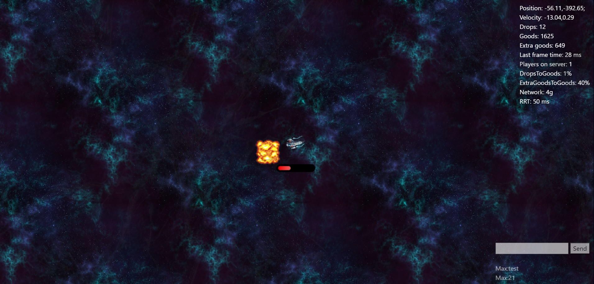
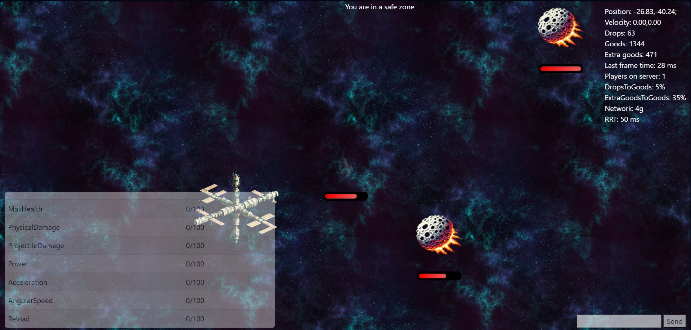

# Web-based multiplayer game on a space theme



It's a simple project implementing a multiplayer web-based game with simple physics system. It's written using ASP.NET Core 7.0. It uses SignalR in order to establish a persistent connection between front and back.
It has sound effects, music, some animations and basic gameplay features. 

It won't be developed further, however it already supports:
- Reasonably stable multiplayer
- Chat between players
- Interaction between players within the game
- System of health, damage and ship upgrades for players




Use it in any way you want. A link to the original repository would be appreciated if you do use parts of my code somewhere.

## Credits

Used projects:
- A lot of free assets from **itch.io**
- **Redis**
- **genbox.velcrophysics** as a physics engine
- **pixi.js** as a graphic lib on frontend

## Usage

To deploy this game yourself:

1. Prepare a machine with Docker installed
2. Create a Docker Compose file (e.g., `docker-compose.yml`):

```yaml
version: "3"

services:
  redis_persistent:
    image: "redis:latest"
    restart: always
    volumes:
      - redis_data:/data

  redis_connections:
    image: "redis:latest"
    restart: always

  redis_chat:
    image: "redis:latest"
    restart: always

  spacewar:
    image: "max05643/spacewar:latest"
    ports:
      - "80:5000"
    depends_on:
      - redis_persistent
      - redis_connections
      - redis_chat
    environment:
      - DiscordLogger__Enabled=false
      - ConnectionStrings__redis_persistent=redis_persistent:6379
      - ConnectionStrings__redis_connections=redis_connections:6379
      - ConnectionStrings__redis_chat=redis_chat:6379

volumes:
  redis_data:
```
3. Run `docker-compose up` in your terminal to start the container.
4. Connect to it with you browser

If you would like to, you can edit the following environment variable in order to change gameplay settings:
```Game__PlayerKickTimeoutInSeconds``` - a player will be kicked after this time period if no input was recevied from them
